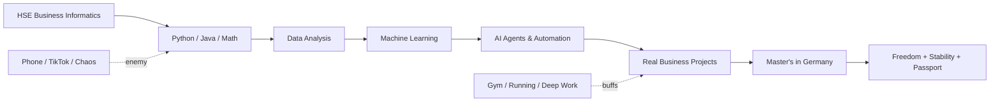
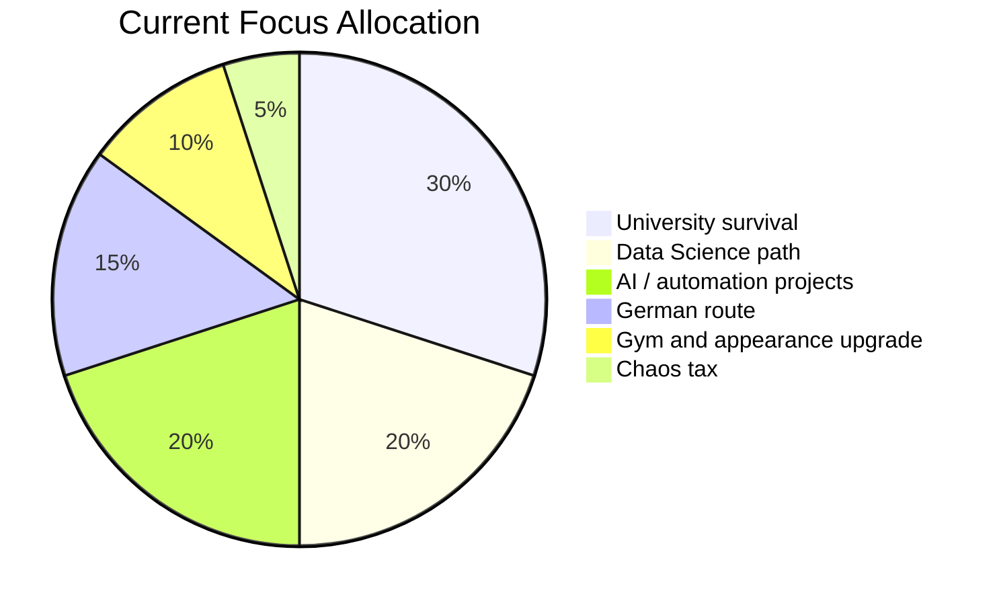
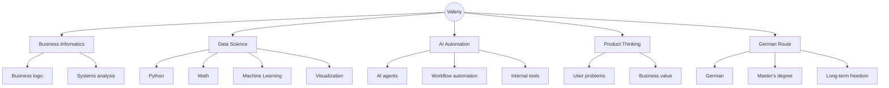

````md
<!-- PROFILE README: acuvyvaf -->

<div align="center">


</div>

---

<div align="center">

### `SYSTEM STATUS: under active refactoring`


</div>

---

## 🧬 Identity Map

```mermaid
mindmap
  root((Valeriy))
    Business Informatics
      HSE Moscow
      Systems thinking
      Product logic
    Data Science
      Python
      ML
      Analytics
      Decision models
    AI Automation
      Agents
      Workflows
      Business tools
      Time-saving systems
    Personal Mission
      Germany
      Freedom
      Money
      Status
      Non-ordinary life
    Current Bugs
      Procrastination
      Phone addiction
      Inconsistent gym
      "Smart but lazy"
    Active Patches
      Discipline
      Projects
      German
      Muscle gain
      Better focus
````

---

## 🛰️ Personal Operating System

```txt
┌──────────────────────────────────────────────────────────────┐
│ VALERIY_OS v19.0                                              │
├──────────────────────────────────────────────────────────────┤
│ Origin:        Moscow                                         │
│ University:    HSE / Business Informatics                     │
│ Direction:     Data Science + AI Automation                   │
│ Core drive:    Freedom, competence, money, status             │
│ Weakness:      Procrastination disguised as "still enough time"│
│ Current mode:  Refactoring personality through shipped work    │
│ Long route:    Moscow → DS → Germany → independent life        │
└──────────────────────────────────────────────────────────────┘
```

---

## ⚡ Stack & Tools

<div align="center">


</div>

---

## 🧭 Route Graph



---

## 📊 Current Character Build



---

## 🧪 What I Build

<table>
  <tr>
    <td><b>AI agents</b></td>
    <td>Tools that reduce boring human work.</td>
  </tr>
  <tr>
    <td><b>Data projects</b></td>
    <td>Turning messy information into decisions.</td>
  </tr>
  <tr>
    <td><b>Automation</b></td>
    <td>Small systems that save time and remove repetitive tasks.</td>
  </tr>
  <tr>
    <td><b>Student survival tools</b></td>
    <td>Because chaos becomes easier when it has an interface.</td>
  </tr>
</table>

---

## 🧠 Internal Monologue

```python
while life != "ordinary":
    learn("data science")
    build("useful systems")
    debug("procrastination")
    improve("body", "style", "discipline")
    move_towards("Germany")
```

---

## 🕸️ Skill Constellation



---

## 📈 GitHub Signals

<div align="center">


</div>

<div align="center">


</div>

---

## 🧩 Current Quests

```txt
[ ] Become dangerous with Python
[ ] Build portfolio projects that do not look like homework
[ ] Learn German seriously
[ ] Move from "potential" to proof
[ ] Stop feeding the algorithm my attention for free
[ ] Gain muscle and look more adult
[ ] Create a life that feels designed, not randomly generated
```

---

## 🪐 Motto

<div align="center">

### I do not want a normal life.

### I want a system that compounds.

</div>

---

<div align="center">


</div>
```
